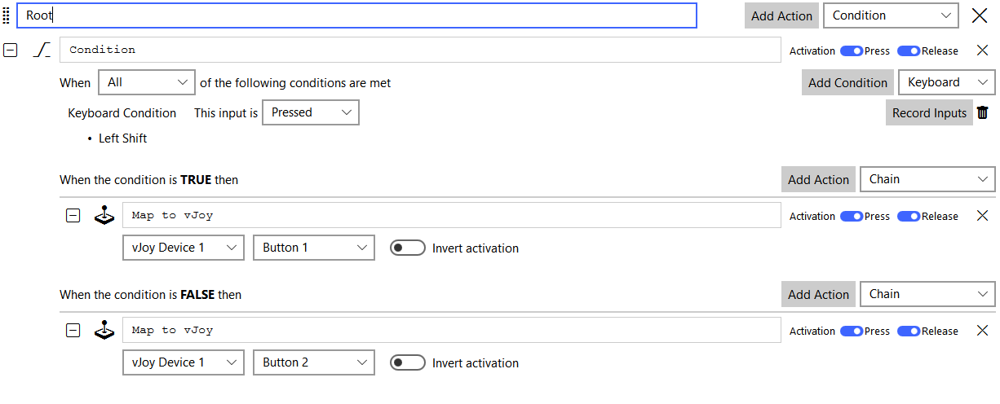
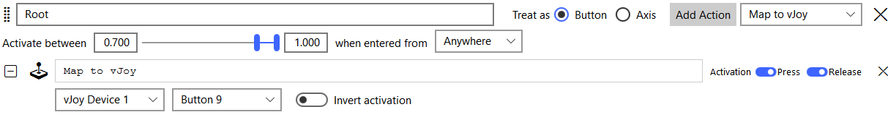
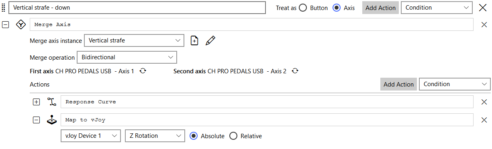
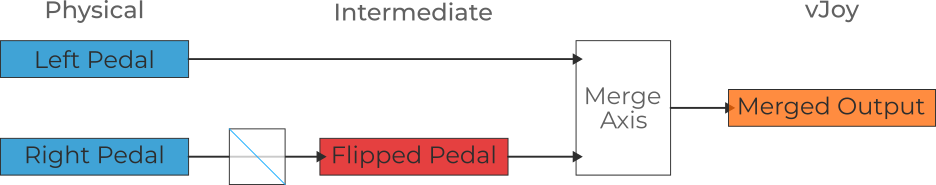
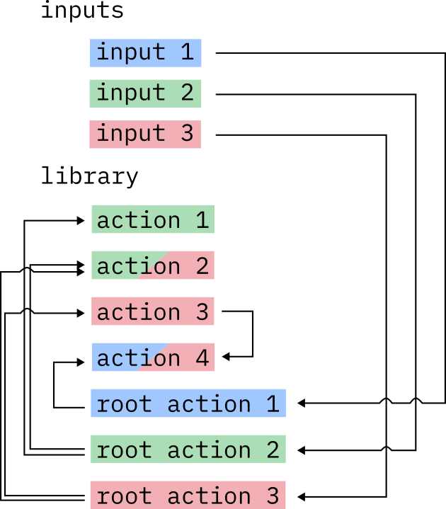

# What is in R14

## Differences to R13
- 64bit only, built on Windows 10
- UI is entirely done in QML, which is an HTML-like markup with javascript system, meaning it should be easier for others to modify
	- Less compact UI (default themes are spacious)
- Due to the UI rewrite forcing a more consistent separation between data and display Gremlin somewhat does live updating of settings. The design is not forcing it and it isn't working for everything, but for many aspects, you can now just modify action settings while Gremlin is running
- No containers anymore
- Actions are able to be copied and referenced
- Intermediate output system allows for arbitrary amounts of synthetic internal axes, buttons, and hats
- No special vJoy tab
- Mode switching is a bit smarter (maybe)
- Virtual button setup is now at the top of every action sequence, making it easier to know about
- No convoluted tabs on actions anymore
	- Virtual buttons are at the top of a sequence
	- Conditions are now an action
- Calibration similar but a bit more refined
- Everything processing input is an action, no special things such as merge tool anymore
- Response curve has a new piece-wise linear curve option

## Goodbye Containers
R13 had actions (doing something) and containers (managing actions), but that meant some desirable usage scenarios were impossible. For example, no Tempo behavior together with a Hat to Buttons container. R14 does away with containers and now just has actions. Actions can contain child actions (tempo, chain, condition) and decide how and when they do their action (Map to X, Macro, Mode change). This means you can nest actions as deep as you want but you'll bear the consequences of it. Gremlin still has the notion of an action having multiple independent sets of actions, in R13 this was represented by containers. In R14 Each input can have multiple action sequences that are entirely independent of each other.

The following two images showcase some of the possible action sequences.

 | A hat with a condition mapping to a set of macros with a hat to buttons container as well as a vJoy remap.
--- | ---
 | **A button with three separate action sequences.**

## Drag & Drop and other usability things
Within an action sequence, you can drag & drop actions around to reorder them. In addition to this, each action can also be folded/unfolded, showing only the action name and a description, taking up less space.

> ⚠️ Drag and drop may still fail or do weird things at times from corner cases as it hasn't been super thoroughly debugged.

## Custom Actions Location
Gremlin now additionally loads actions from a user-specified folder in addition to the actions shipped with Gremlin by default. This means that actions that may not be of general use can easily be loaded in Gremlin without having to modify the code, allowing people to curate their own action collections.

## Condition
In R13, conditions were a separate tab on the container that allowed the addition of conditions at either the container or action level. The design of the condition dialogue also led to various confusing behaviours. In R14, conditions are simply actions that evaluate a condition, and based on the outcome, one of the two branches (true / false) containing child actions is executed. This makes the control flow easier to see, and with drag & drop support, things should be less painful to rearrange as well.

  |  Example of a condition setup.
--- | ---

## Virtual Button
In R13, a virtual button tab would appear when certain actions were selected on an axis or a hat. This made it hard to discover that feature and also a bit cumbersome to configure. In R14, each action sequence added to an axis or hat has the option to be configured to act as a button, which then displays the virtual button configuration and also changes the actions that can be added to that action sequence.

>⚠️ There are likely some quirks with going back and forth between the virtual button and natural behaviour, as I haven't decided yet how to deal with that fully.

 | Example of what the virtual button interface looks like.
--- | ---

## Merge Axis
In R13, merging two axes was done via a custom dialogue, as the design of the profile structure didn't permit actions to be associated with two physical inputs. The changes in R14's profile structure mean that merging axes can now be implemented as a regular action. The action needs to be assigned to two different axes, each of which can be assigned to one of the two axis slots. There are a variety of things that are commonly desired in a merge axis scenario, which were not possible nicely or at all in R13, including:
- Apply a response curve to an axis before merging
  - Utilize intermediate outputs for this
- Response curve on the merged output
  - Was doable with vJoy tabs but had odd side effects

 | Example of a merge axis on the toe brakes of a pedal with subsequent response curve and vJoy mapping actions.
--- | ---

## Intermediate Output
R14 adds a system that permits the creation of an arbitrary number of named axes, buttons, and hats. These are only visible internally to Gremlin but can be used as intermediary outputs (hence the name) for a variety of tasks, such as:
- Pre-process inputs as described in the merge axis case
- Storing state similar to how people use vJoy buttons in R13
- Mapping multiple physical axes to one axis to share output and have a consistent configuration without duplication
These intermediate outputs (IO) work and behave exactly like any other physical device but can be named, and their numbers are not limited. Under the hood, the same signalling mechanism used by other inputs is used on the IO system as well.

 | Illustration of how the IO system can be used for a merge axis action with response curve pre-processing of one of the axes being merged.
--- | ---

## Profile structure
R13 had a very direct profile structure, where for each device, all inputs were listed, and the actions associated with an input were nested within that input's entry. R14 decouples inputs and actions entirely. The profile is made up of a library containing actions and inputs that refer to entries in the library. The figure below visualizes this difference between the two profiles. Actions are stored in a library and have an associated unique identifier that makes it possible to refer to them uniquely. If an action contains other actions, such as a tempo action, then only the referred "child" actions' identifiers are stored in the "parent" action but not the actions' contents. For physical devices, only those inputs that have an action associated with them are stored. Each entry specifies the input as well as the mode and the set of root actions associated with that particular input.

This separation of inputs and actions permits the same action to be used with multiple physical inputs or be contained in several action sequences. Some examples where this is useful are:
- Sharing a response curve between multiple axes that map to different vJoy outputs
- Bind the same action, such as a macro, to two different physical inputs

R14 Profile Structure | R13 Profile Structure
--- | ---
 | 

Some things to consider here
- R14 looks much messier and is also more tricky to read for a human due to the unique identifiers
- R14 allows the reuse of actions, thus sharing of settings such as curves
- R14 allows arbitrary nesting of containers
- R13 needs to duplicate actions
- R13 doesn't support nesting, only two levels exist: containers which contain actions. As a consequence the input 3 scenario is impossible
- R14 actions are uniquely identifiable with an ID as such the library repos consisting of "game mappings" can be made and updated and will then automatically update when loaded (needs to be implemented, but that's part of the design idea)
- R13 always lists all available physical inputs even if nothing is assigned to them, making profiles long especially on setups with tons of devices, R14 only lists inputs that have an associated action

There are two aspects the library system allows that I haven't gotten around to implementing yet but want to as soon as possible:
- Assigning library actions (likely via drag & drop) from a searchable library interface onto physical/IO inputs. This would allow one to build a profile quickly using a library of actions created by someone else. This is already possible on a technical level, but the UI side is not yet there.
- Linked with the above, once people start using pre-made action libraries, the unique identifiers of actions means that they can be changed and updated and people can simply load a new version of the library and their actions will reflect the changes. This only needs a bit of supporting code to tell Gremlin one wants to load and update the library only.

# What is still missing
The following, in no particular order, is a list of things I'm aware of that still need to be added to get back to feature parity with R13.
- [ ] Input repeater and make it work with complex action sequences
- [ ] Automatically assign remaps to inputs, i.e. the old 1:1 Mapping tool but more flexible, likely a dialogue where you configure what behaviour you want
- [ ] Profile auto load system including support to say if profiles turn off when the focus is lost
- [ ] System to enable/disable and reorder actions in the drop-down list
- [ ] Add the user plugin system back and fix some of its bugs
- [ ] Profile conversion from R13 (unclear when/if that happens)
- [ ] TTS action, looking into whether Qt's TTS system should be used instead
- [ ] Missing configuration options
  - [ ] Ability to designate vJoy devices as inputs
  - [ ] Macro default action delay
  - [ ] vJoy device default initialization values
  - [ ] Mode to use when activating Gremlin
- [ ] Prettify device information dialog
- [ ] Cheatsheet generation (way down the line, maybe)
- [ ] Profile creator but via library things so very different
- [ ] Log viewing tools
- [ ] Reworked and renamed swap devices tool that doesn't omit information (should be significantly easier with R14's profile layout)
- [ ] Support for command line options
- [ ] Build the sphinx documentation
- [ ] Properly integrate dark mode and make sure it is readable
- [ ] Action summaries on inputs
